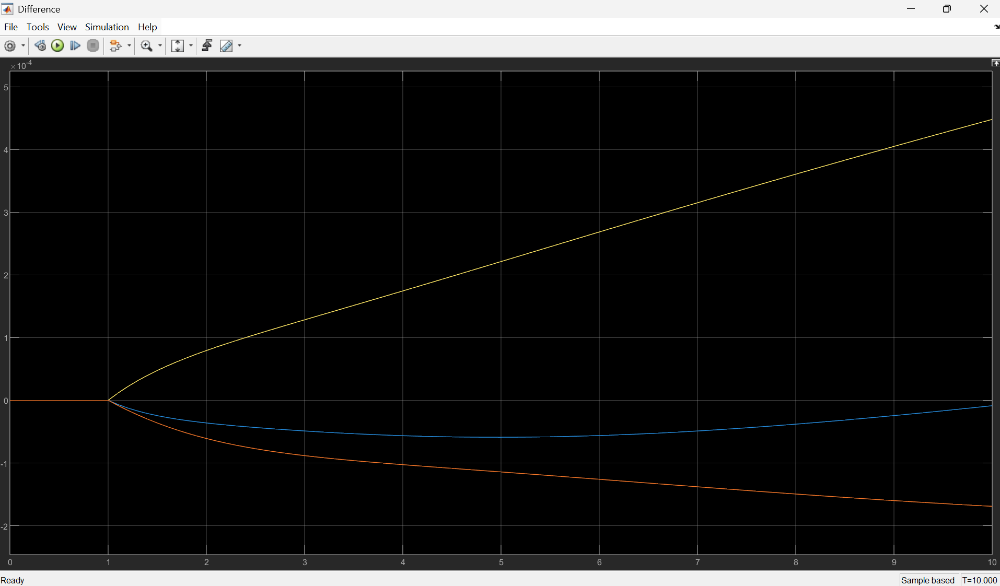
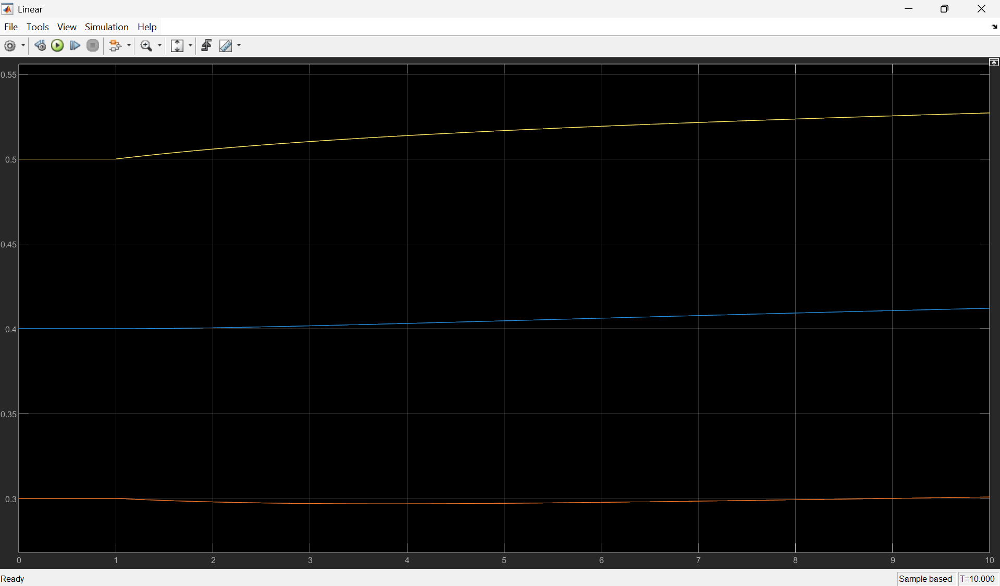
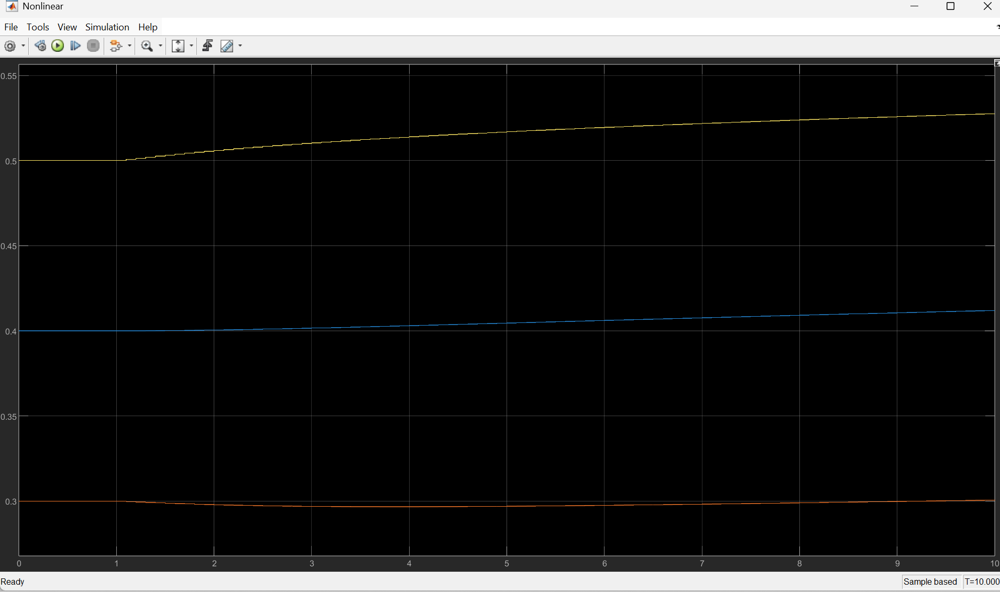

# Three-Tank System Modeling & Linearization

This project simulates a non-linear three-tank liquid level system and compares its performance against a linearized State-Space representation.

## Simulation Results
The model validates that the linearized system (A, B, C, D matrices) accurately tracks the nonlinear dynamics, with an error magnitude of less than 10^{-4} near the stationary operating point.

## Files
ThreeTankOpensystem.slx`: The Simulink model containing both nonlinear and linear branches.
init_three_tank.m`: MATLAB script containing system parameters (tank area, tube constants) and State-Space matrices.

## How to Run
1. Open MATLAB and run `init_three_tank.m` to load variables into the workspace.
2. Open `ThreeTankOpensystem.slx`.
3. Click **Run** to view the Comparison Scopes (Nonlinear vs. Linear).

